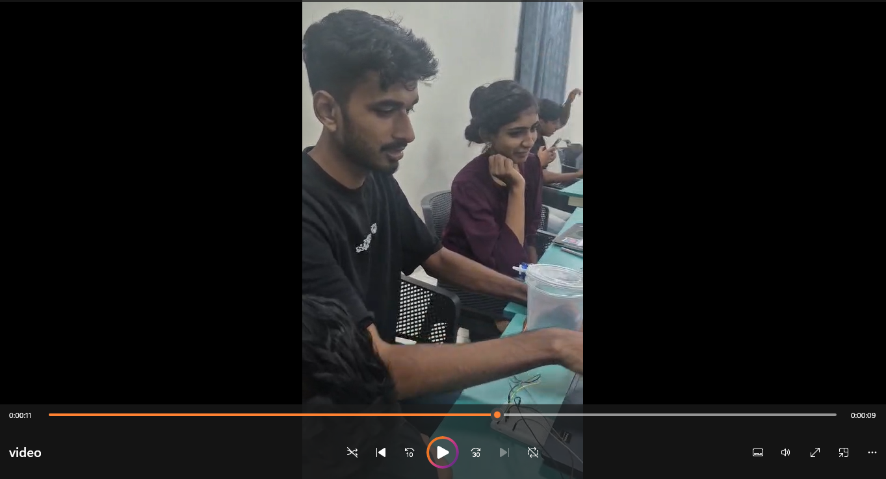

# AI Interactive Dustbin 🎯

## Basic Details

### Team Name: Born Useless

### Team Members

- Team Lead: Varsha Gireesh - Muthoot Institute of Technology and Science
- Member 2: Arjun Biju - Muthoot Institute of Technology and Science

### Project Description

The **AI Interactive Dustbin** is a smart dustbin that uses a camera, AI/computer vision, and an Arduino-controlled servo mechanism to interact with people and respond to waste-disposal actions. Instead of silently accepting everything, the dustbin can detect human interaction, analyze the action, control its lid, and provide humorous responses.

### The Problem (that doesn't exist)

People have become far too comfortable throwing waste into completely obedient dustbins.

A normal dustbin never complains, never judges, and never roasts anyone for throwing waste incorrectly. Clearly, this is a serious problem that nobody asked us to solve.

### The Solution (that nobody asked for)

We built a dustbin that **has opinions**.

Using a camera and AI/computer vision, the system observes the person and their interaction with the dustbin. The Python application processes the camera input, makes the appropriate decision, and communicates with an Arduino through serial communication. The Arduino controls a servo motor that operates the physical lid.

The dustbin can then respond to the detected interaction with its own humorous reactions.

In short:

**Person → Camera → AI → Decision → Arduino → Servo → Interactive Dustbin**

Because apparently even a dustbin deserves the right to say *"Absolutely not."*

## Technical Details

### Technologies/Components Used

For Software:

- **Languages:** Python, C/C++ (Arduino)
- **Computer Vision / AI:** OpenCV, YOLOv8, MediaPipe
- **AI Models:**
  - `yolov8n.pt` — YOLOv8 object-detection model
  - `hand_landmarker.task` — MediaPipe hand landmark model
  - `pose_landmarker_lite.task` — MediaPipe pose landmark model
- **Libraries:** OpenCV, PySerial, Ultralytics, MediaPipe
- **Communication:** Serial communication between Python and Arduino
- **Tools:** Python, VS Code, Arduino IDE, Git, GitHub

For Hardware:

- Arduino-compatible microcontroller
- Servo motor for automated lid control
- Laptop with webcam
- USB cable for Arduino serial communication
- Dustbin body
- Servo-controlled lid mechanism
-  Jumper wires
- Breadboard/connectors as required
- Mechanical mounting materials

### AI Model Files

The project uses the following model files for computer-vision processing:

| ModelPurpose                |                                           |
| --------------------------- | ----------------------------------------- |
| `yolov8n.pt`                | Object detection                          |
| `hand_landmarker.task`      | Hand landmark detection and hand tracking |
| `pose_landmarker_lite.task` | Human pose/landmark detection             |

The models are stored in the project's model-assets directory and are integrated into the computer-vision pipeline.

### Implementation

For Software:

The software follows a modular architecture separating camera input, AI/computer-vision processing, decision making, hardware communication, and interactive responses.

The AI pipeline combines **YOLOv8 object detection, MediaPipe hand landmark detection, and MediaPipe pose landmark detection** to analyze the user's interaction with the dustbin.

The main processing flow is:

```text
                  Webcam
                     ↓
              Camera Input
                     ↓
          ┌──────────┴──────────┐
          ↓                     ↓
      YOLOv8              MediaPipe
 Object Detection       Hand + Pose
          └──────────┬──────────┘
                     ↓
             Action Analysis
                     ↓
              Decision Logic
                ↙         ↘
            ACCEPT       REJECT
                ↓         ↓
             Response / Interaction
                     ↓
             Serial Communication
                     ↓
                  Arduino
                     ↓
                Servo Motor
                     ↓
                Dustbin Lid


```

The Python application acts as the main integration layer. It captures webcam frames, performs computer-vision processing using the configured AI models, analyzes the user's interaction, determines the appropriate response, and communicates with the Arduino through serial communication.

The Arduino receives the commands and controls the servo motor responsible for the physical lid mechanism.

# Installation

### 1. Clone the Repository

```bash
git clone https://github.com/Varsha09dec/AI_Interactive_Dustbin.git
cd AI_Interactive_Dustbin


```

### 2. Create a Python Virtual Environment

```bash
python -m venv venv


```

### 3. Activate the Virtual Environment

**Windows:**

```bash
venv\Scripts\activate


```

**Linux/macOS:**

```bash
source venv/bin/activate


```

### 4. Install Python Dependencies

```bash
pip install -r requirements.txt


```

The required AI model files are included in the repository under:

```text
AI_Interactive_Dustbin/assets/models/


```

These include:

- `yolov8n.pt`
- `hand_landmarker.task`
- `pose_landmarker_lite.task`

### 5. Arduino Setup

1. Connect the Arduino-compatible microcontroller to the computer using USB.
2. Open the Arduino firmware in **Arduino IDE**.
3. Select the correct board and COM/serial port.
4. Upload the firmware to the Arduino.
5. Connect the servo motor and other hardware components according to the project circuit.
6. Configure the serial/COM port in the Python application if required.

> **Note:** The exact COM port may vary depending on the computer. Check the Arduino IDE under **Tools → Port** and use the corresponding port in the Python configuration.

# Run

### Start the Python Application

Make sure the virtual environment is activated:

```bash
venv\Scripts\activate


```

Run the main application:

```bash
python main.py


```

The application starts the webcam-based computer-vision pipeline and processes the user's interaction with the dustbin.

The complete hardware workflow is:

```text
Webcam
   ↓
AI / Computer Vision
   ↓
Action Analysis
   ↓
Decision
   ↓
Python Serial Communication
   ↓
Arduino
   ↓
Servo Motor
   ↓
Dustbin Lid


```

For the complete physical demonstration, the webcam, Arduino, servo mechanism, and required power connections must be properly connected and configured.

> **Note:** Hardware-specific settings such as the Arduino COM port may need to be changed according to the system being used.

### Project Documentation

For Software:

The software is divided into modular components so that AI/computer-vision processing, hardware communication, responses, and application integration can be developed and tested independently.

# Screenshots (Add at least 3)

> Add at least three screenshots from the **actual working project** below.

*AI/computer-vision system detecting no person approaching the dustbin.* 


*AI/computer-vision system detecting a person approaching the dustbin.*


*System analyzing the user's interaction or waste-disposal action.*


*Interactive dustbin responding to the detected action.*

# Diagrams

*Diagram of workflow*


For Hardware:

# Schematic & Circuit

*Circuit showing the microcontroller, servo motor, power connections, and communication interface.*

*Hardware schematic illustrating the electrical connections used in the prototype.*

# Build Photos

*Main components used in the prototype, including the microcontroller, servo motor, wiring, webcam, and dustbin components.*

*Build process showing the assembly of the servo mechanism and integration of the electronic components with the dustbin.*

*Final AI Interactive Dustbin prototype with the AI system, electronics, and physical lid mechanism integrated.*

### Project Demo

# Video

**Click the Image to Watch the video**


*The demo demonstrates the complete interaction pipeline, including camera-based detection, AI/computer-vision processing, decision making, Arduino serial communication, servo-controlled lid operation, and the dustbin's interactive response.* 

Watch the video :
 [(AI_Interactive_Dustbin/video.mp4)

## Team Contributions

- **Varsha Gireesh:** AI/computer-vision development, Python application integration, decision logic, software testing, system integration, and project documentation.
- **Arjun Biju:** Arduino/microcontroller programming, servo control, hardware integration, circuit implementation, mechanical construction, dustbin lid mechanism, and hardware testing.

### AI Disclosure

AI tools, including ChatGPT, were used as development assistance for tasks such as debugging, code suggestions, architectural guidance, documentation, and problem solving. The project team was responsible for adapting, integrating, testing, and validating the implementation used in the final project.
